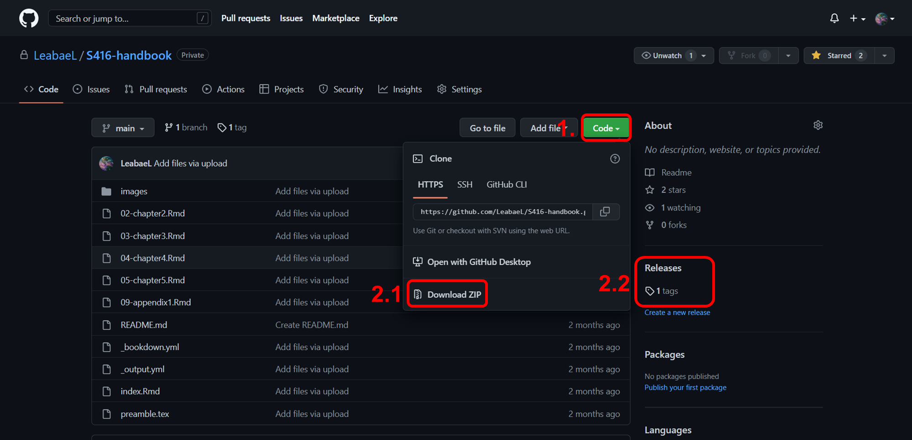
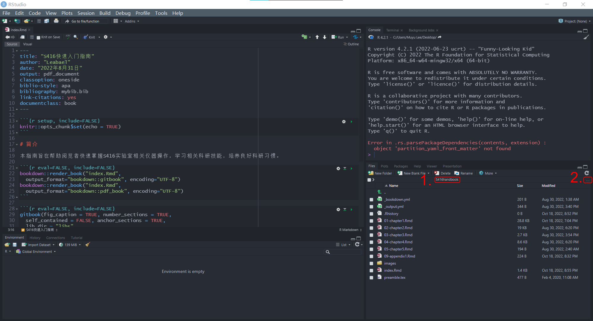
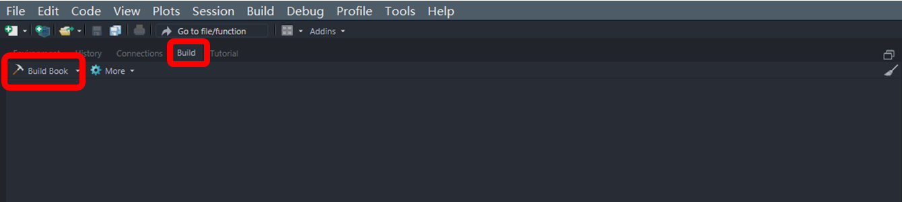
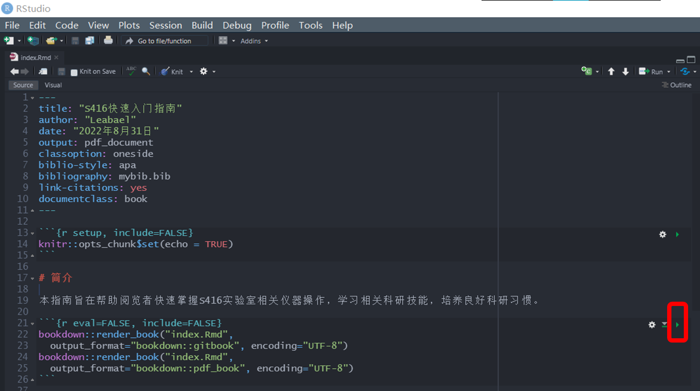

# S416-handbook

这是S416实验室快速入门手册，旨在帮助新加入的同学快速掌握实验室所需技能。

## 手册使用说明

在打开仓库界面后可以通过两种方式获得手册原始文件

1. 点击code按钮后，选择Download zip进行下载

2. 点击Releases下方按钮进行下载



在下载完成后，在Rstudio将解压的文件夹设置为当前工作路径：

1. 直接点击进入解压后的文件夹，打开任意一个Rmd文件，观察`1`处路径

2. 如为成功点击`2`处，选择解压后文件夹



在设置成功后，运行以下命令进行必要包的安装和激活：

```{r}

 install.packages(c("bookdown", "rmarkdown", "tinytex"))
 
 library(bookdown)
 library(rmarkdown)
 library(tinytex)

```

打开`S416-handbook.Rproj`选择`Build`，`Build Book`进行编译，或者点击右侧下拉箭头选择想要的输出形式（推荐第一个gitbook格式）



或者打开`index.Rmd`文件运行代码，待运行完成后查看手册



之后进入文件夹点击生成的`_book`文件夹，点击任意`.html`文件或`CBook.pdf`文件，进行浏览学习
